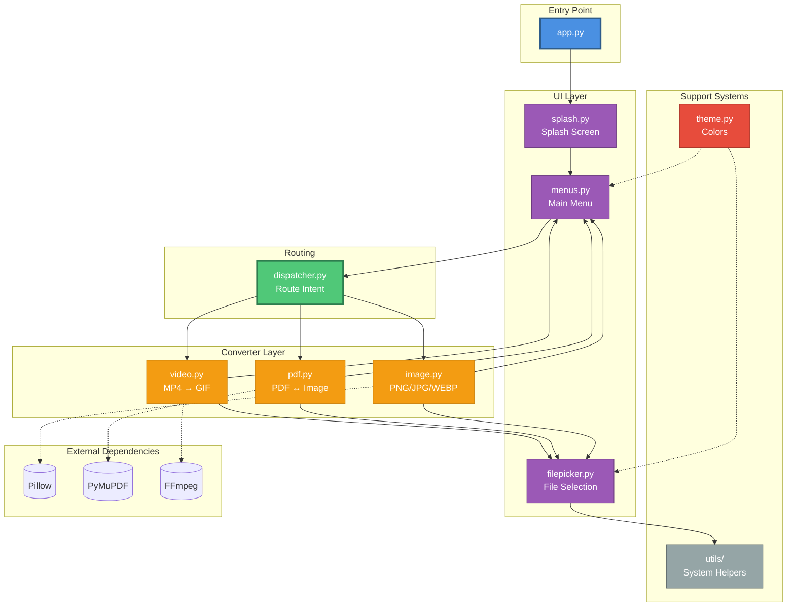

# Morphy Architecture

## Overview

Morphy follows a layered architecture where each layer has a single responsibility and avoids leaking logic into adjacent layers.

## Architecture Diagram

*(charts made by claude)*

## Core Design Principles

- **Separation of UI and core logic**
- **Explicit data flow**
- **No hidden global state**
- **Minimal coupling between modules**
- **Feature scope intentionally limited**

## Layer Responsibilities

### Entry Point (`app.py`)
- Application lifecycle
- Startup sequence
- High-level control flow

### UI Layer (`ui/`)
- Display menus and prompts
- Collect user input
- Validate basic input correctness
- Present results and errors

### Dispatcher (`core/dispatcher.py`)
- Route user intent to the correct converter
- Act as a bridge between UI and conversion logic

### Converter Layer (`converters/`)
Each converter follows the same pattern:
- **Image Converter** - PNG, JPG, WEBP conversion (Pillow)
- **PDF Converter** - Image ↔ PDF conversion (PyMuPDF)
- **Video Converter** - MP4 → GIF conversion (FFmpeg)

### Support Systems
- **Utils** - Shared helper logic and system operations
- **Theme** - Centralized color definitions and styling

## Error Handling Strategy

- Fail early on invalid input
- Validate before conversion
- Surface errors clearly to the user
- Avoid silent failures
- Never crash on user input

## Summary

Morphy's architecture is intentionally simple and explicit:
- **UI handles interaction**
- **Dispatcher handles routing**
- **Converters handle work**
- **Utilities handle system interaction**
