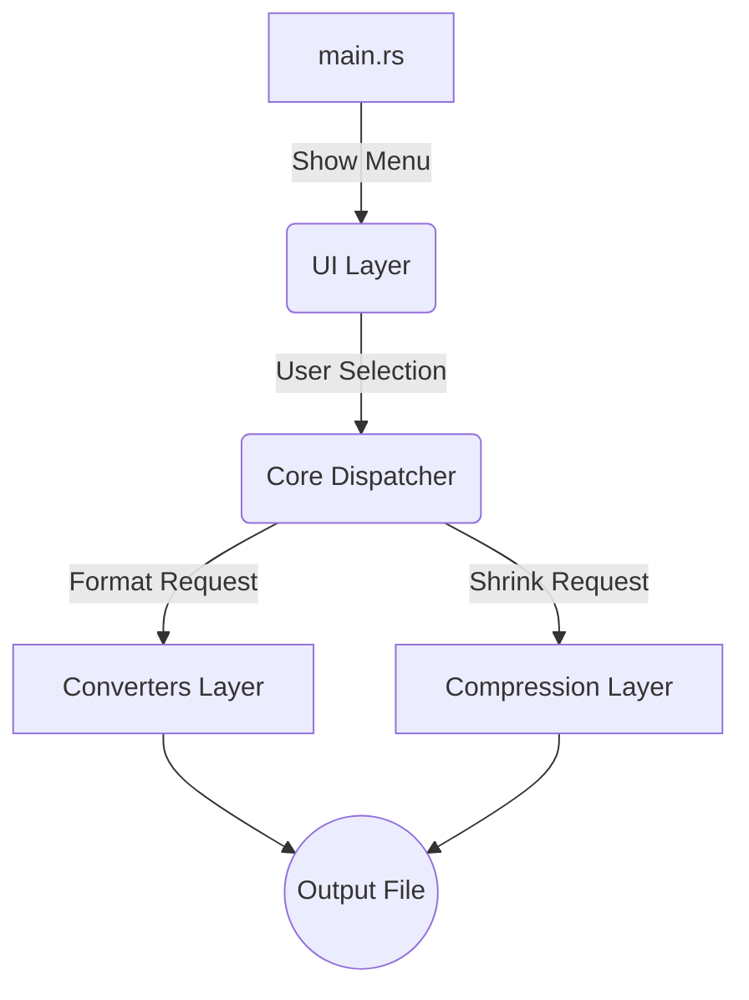

# Morphy Architecture

Morphy is designed around a strictly layered architecture that cleanly separates user interaction (UI), routing logic, and the actual processing (conversion/compression) logic. This separation ensures that the codebase is easy to maintain, extend, and test.

## High-Level System Design

The system is composed of four primary layers:

1. **Entry Point (`main.rs`)**: Controls the application lifecycle.
2. **UI Layer (`ui/`)**: Handles all interactions with the user.
3. **Core Layer (`core/`)**: Routes user intentions to the appropriate processor.
4. **Processing Layer (`converters/` and `compression/`)**: Executes the heavy lifting.

```mermaid
graph TD
    A[main.rs] -->|Show Menu| B(UI Layer)
    B -->|User Selection| C(Core Dispatcher)
    C -->|Format Request| D[Converters Layer]
    C -->|Shrink Request| E[Compression Layer]
    
    D --> F((Output File))
    E --> F
```

---

## Detailed Layer Breakdown

### 1. Entry Point (`src/main.rs`)
The entry point initializes the application, displays the welcome splash screen, and enters the main event loop. In each iteration of the loop, it delegates to the UI layer to gather a menu choice, then delegates to the Core layer to handle that choice.

### 2. UI Layer (`src/ui/`)
This layer is solely responsible for input/output operations with the user. It strictly avoids any file manipulation or processing logic.

- **`splash.rs`**: Renders the ASCII art banner on startup.
- **`menus.rs`**: Uses the `dialoguer` crate to provide interactive selection menus (e.g., Image Conversion, Video to GIF). It defines the `MenuChoice` enum which acts as the data contract between the UI and the Dispatcher.
- **`filepicker.rs`**: Prompts the user for a file path, ensuring the input is captured correctly.
- **`theme.rs`**: Centralizes styling constants using the `console` crate to maintain a consistent color palette across the app.

### 3. Core Layer (`src/core/`)
The core layer acts as the orchestrator.

- **`dispatcher.rs`**: Contains `dispatch()` and `dispatch_compression()`. These functions take a `MenuChoice` (or `CompressionChoice`) and a file path, and route them to the specific module in the Processing layer. This prevents `main.rs` from becoming a monolithic switch statement.

### 4. Processing Layer
The processing layer contains all the domain logic. It is split into two modules:

#### Converters (`src/converters/`)
Handles format transformations:
- **`image.rs`**: Uses the `image` crate to load and save images in different formats (PNG, JPG, WEBP).
- **`pdf.rs`**: Integrates with the `mupdf` crate (via C bindings to MuPDF) to render PDFs to images or wrap images into a PDF. This module uses conditional compilation (`#[cfg(feature = "pdf")]`) to allow the app to build without `clang-devel` dependencies.
- **`video.rs`**: Acts as a wrapper around FFmpeg using `std::process::Command` to execute a two-pass Video-to-GIF conversion.
- **`markdown.rs`**: Parses Markdown using `pulldown-cmark` and generates PDFs by invoking `weasyprint` via a subprocess.

#### Compression (`src/compression/`)
Handles file size optimization:
- **`image.rs`**: Implements a binary search algorithm to hit target file sizes by intelligently sweeping JPEG quality and Lanczos3 dimension scaling.
- **`pdf.rs`**: Re-saves PDFs using `mupdf` with aggressive garbage collection and stream deflation.

---

## Data Flow Example

Here is a step-by-step example of how data flows through the system when a user compresses an image:

1. **`main.rs`** calls `show_menu()`.
2. **`ui/menus.rs`** returns `MenuChoice::Compression`.
3. **`main.rs`** calls `show_compression_menu()` and gets `CompressionChoice::ImageCompress`.
4. **`main.rs`** calls `pick_file()` to get the target file path.
5. **`main.rs`** calls `dispatch_compression(choice, path)`.
6. **`core/dispatcher.rs`** routes the call to `compression::image::compress_image(path)`.
7. **`compression/image.rs`** analyzes the file, asks the user for a target size (using `dialoguer`), and executes the binary search algorithm via the `image` crate.
8. The final compressed image is written to disk, and control returns to the `main.rs` loop.

---

## Crate Dependency Map

Morphy leverages several robust Rust crates to achieve its functionality while keeping the codebase clean:

| Crate | Purpose in System |
|-------|-------------------|
| **dialoguer** | Powers all interactive prompts and menus in the UI layer. |
| **console** | Provides ANSI color styling and terminal manipulation. |
| **comfy-table** | Renders before/after statistics in clean ASCII tables. |
| **indicatif** | Displays progress bars during long operations (like PDF extraction). |
| **image** | Core engine for all image decoding, encoding, and resizing. |
| **mupdf** | High-performance C-engine used for parsing, rendering, and writing PDFs. |
| **pulldown-cmark** | Parses Markdown into HTML for the PDF converter pipeline. |
| **anyhow** | Simplifies error propagation across the various boundaries. |

## Error Handling Philosophy

- **No Panics**: The application should never panic on bad user input or missing files.
- **Graceful Degradation**: If an external dependency (like FFmpeg or WeasyPrint) is missing, the subprocess fails gracefully and provides actionable installation instructions to the user.
- **Feature Gating**: Complex C-dependencies (like `mupdf`) are placed behind Cargo features so that the application can still compile and serve its other functions in restricted environments.
