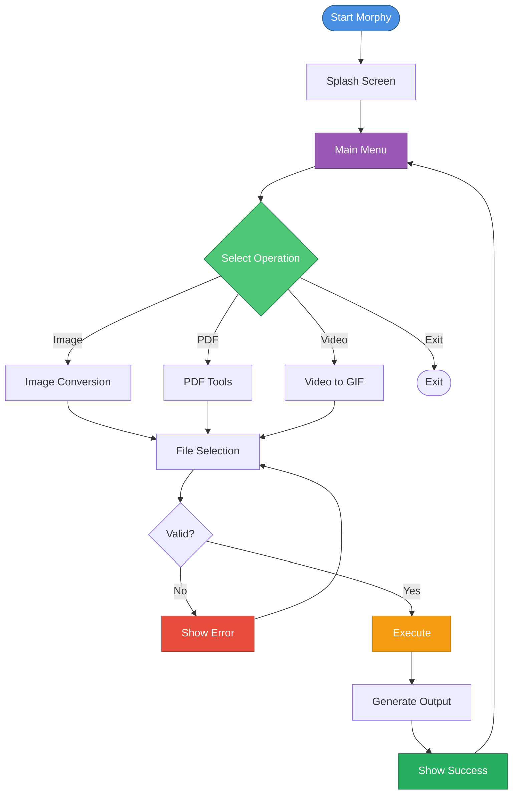

# Morphy – Workflow

Morphy follows a **guided, step-by-step CLI workflow** prioritizing clarity and predictability.

## Global Workflow

## Operations

### Image Conversion
**Formats:** PNG, JPG, WEBP

1. Select image file
2. View metadata (format, dimensions)
3. Choose target format
4. Convert and save with `_converted` suffix

### PDF Tools

**Image → PDF**
- Select image file
- Choose page mode (A4 or image-sized)
- Generate PDF

**PDF → Image**
- Select PDF file
- Render each page as PNG
- Save all pages

### Video to GIF
**Format:** MP4 → GIF

1. Check FFmpeg availability
2. Select video file
3. Configure FPS and width
4. Generate GIF with palette optimization
5. Cleanup temp files

## Key Features

- **File Validation:** All paths verified before processing
- **Safe Output:** Files saved with suffixes, never overwrite
- **Clear Errors:** Immediate feedback on failures
- **Loop to Menu:** Return after each operation

## Design Principles

- Interactive by default
- No destructive actions without confirmation
- Beginner-friendly with clear prompts
- Predictable output locations
